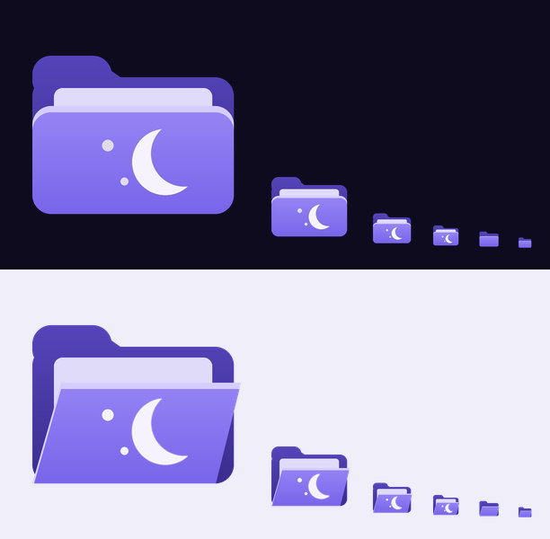

# 🌙 Moon – Windows 11 Theme

Ein dunkles Windows-11-Theme in **Nachtblau + Lila**. Es färbt nicht nur den Hintergrund, sondern möglichst alles, was zu Windows 11 gehört: Startmenü, Taskleiste, Einstellungen, Infocenter, Explorer, Alt+Tab, Titelleisten und Sperrbildschirm.




## Was wird umgestylt?

| Bereich | Wie | Datei |
| --- | --- | --- |
| Hintergrund (3 Motive, 4K) | Installationsskript | `theme/Wallpapers/` |
| Dunkelmodus, Transparenz, Akzentfarbe Lila | Installationsskript | `install.ps1` |
| **Einstellungen-App** (Grundfarben) | Dunkelmodus, lila Akzent (Links, Schalter, Markierungen), lila Mica-Tönung durch den Hintergrund | `install.ps1` |
| **Einstellungen-App** mit Sternenhimmel (Karten, Startseite, Suchfeld, Symbole, Menüs, Dialoge) | Windhawk-Mod | `windhawk/settings.yaml` |
| Titelleisten und Fensterrahmen | Installationsskript | `install.ps1` |
| **Ordnersymbole** (lila Ordner mit Mondsichel, passend zu Moon Explorer) | Installationsskript (Admin) | `theme/Icons/` |
| **Sounds**: eigenes Soundschema „Moon“ mit sanften Glockenklängen (Benachrichtigung, Fehler, Warnung, USB, Akku, Anmelden …) | Installationsskript | `theme/Sounds/` |
| **Startmenü** mit Sternenhimmel (Angeheftet, Aktuell, Alle, Kategorien, Suche) | Windhawk-Mod | `windhawk/start-menu.yaml` |
| **Taskleiste** im Matter-Stil: durchsichtig, Apps als lila Glas-Kacheln, Moon-Start-Logo, Infobereich, Alt+Tab, Taskansicht | Windhawk-Mod | `windhawk/taskbar.yaml` (alter Glas-Look: `taskbar-glass.yaml`) |
| Infocenter: Benachrichtigungen, Kalender, Schnelleinstellungen, Medien, Sprunglisten | Windhawk-Mod | `windhawk/notification-center.yaml` |
| Explorer | Windhawk-Mod | `windhawk/file-explorer.yaml` |
| Klassische Programme und Kontextmenüs (optional) | Windhawk-Mod | `windhawk/translucent-windows.yaml` |
| Sperrbildschirm (optional) | `install.ps1 -LockScreen` | – |
| Windows Terminal (optional) | Farbschema | `extras/windows-terminal-moon.json` |

## Installation

### Am einfachsten: Moon Installer (App)

1. Repository als ZIP herunterladen und entpacken.
2. **`Moon Installer.cmd` doppelklicken** und die Admin-Abfrage bestätigen.
3. Hintergrund und Taskleiste auswählen → **„Alles installieren“**.

Die App erledigt dann der Reihe nach:
- **Grund-Theme**: Hintergrund, Dunkelmodus, Akzentfarbe, Titelleisten, Moon-Ordnersymbole (ruft `install.ps1` auf)
- **Windhawk** installieren (über winget), falls noch nicht vorhanden
- **Mods**:
  - Mit Windhawk 2.x (hat `windhawk-cli.exe`) werden die Mods komplett automatisch installiert.
  - Mit Windhawk 1.x öffnet die App Windhawk. Dort klickst du bei jedem angezeigten Mod einmal auf „Install“. Mit „Name kopieren“ findest du ihn schnell.
- **Moon-Styles eintragen**: Sobald ein Mod installiert ist, schreibt die App den Moon-Style direkt in Windhawk. Kopieren und Einfügen ist nicht nötig.

Mit dem Button „Theme entfernen“ machst du alles wieder rückgängig.

Falls sich der Installer sofort wieder schließt: Fehler werden jetzt als Meldung angezeigt und in `%TEMP%\MoonInstaller.log` gespeichert.

Lieber manuell? Dann so:

### Schritt 1: Grund-Theme

1. Repository als ZIP herunterladen und entpacken (oder klonen).
2. **`Install.cmd` doppelklicken.**
   Die Einstellungen-App geht dabei kurz auf und wieder zu, danach startet der Explorer neu.

Das war's für Hintergrund, Dunkelmodus, Akzentfarbe, die Grundfarben der Einstellungen-App und Titelleisten.

Optionen (in PowerShell im Ordner ausführen):

```powershell
.\install.ps1 -Wallpaper crescent        # night (Standard) | crescent | horizon
.\install.ps1 -Slideshow                 # alle 30 min wechseln
.\install.ps1 -TaskbarAlignment Left     # Taskleisten-Symbole links
.\install.ps1 -NoAccentOnTaskbar         # Taskleiste nicht lila einfärben
.\install.ps1 -NoFolderIcons             # gelbe Standard-Ordner behalten
.\install.ps1 -KeepThumbnails            # Miniaturansichten anlassen (Moon-Ordner nur in Liste/Details/kleinen Symbolen)
.\install.ps1 -NoSounds                  # Windows-Sounds behalten
.\install.ps1 -LockScreen                # auch Sperrbildschirm (PowerShell als Admin)
.\install.ps1 -InstallWindhawk           # Windhawk gleich mitinstallieren
```

### Schritt 2: Startmenü, Taskleiste, Infocenter und Explorer (Windhawk)

Windows lässt Startmenü und Taskleiste nicht direkt umfärben. Dafür gibt es [Windhawk](https://windhawk.net), ein kostenloses Open-Source-Tool mit Mods, die genau diese Teile stylen.

1. **Windhawk installieren**: von [windhawk.net](https://windhawk.net) oder mit `.\install.ps1 -InstallWindhawk`.
2. In Windhawk oben rechts **„Explore“** öffnen (in der deutschen Oberfläche ggf. „Entdecken“), nach diesen Mods suchen und sie installieren:
   - **Windows 11 Start Menu Styler**
   - **Windows 11 Taskbar Styler**
   - **Windows 11 Notification Center Styler**
   - **Windows 11 File Explorer Styler**
   - **Windows 11 Settings Styler**
   - *(optional)* **Translucent Windows**
3. Für jeden Mod:
   1. Mod öffnen → Tab **„Settings“ / „Einstellungen“**
   2. Auf **„Textual mode“** umschalten
   3. Den kompletten Inhalt der passenden Datei aus dem Ordner `windhawk/` einfügen (alles markieren und ersetzen)
   4. **„Save settings“** klicken

| Mod | Datei |
| --- | --- |
| Windows 11 Start Menu Styler | `windhawk/start-menu.yaml` |
| Windows 11 Taskbar Styler | `windhawk/taskbar.yaml` |
| Windows 11 Notification Center Styler | `windhawk/notification-center.yaml` |
| Windows 11 File Explorer Styler | `windhawk/file-explorer.yaml` |
| Windows 11 Settings Styler | `windhawk/settings.yaml` |
| Translucent Windows | `windhawk/translucent-windows.yaml` |

Falls das Startmenü sich nicht sofort ändert: einmal öffnen und schließen oder den Explorer neu starten (Task-Manager → „Windows-Explorer“ → „Neu starten“).

### Schritt 3 (optional): Feinschliff

- **Sounds**: Die Moon-Klänge sind komplett selbst erzeugt, also ohne fremde Aufnahmen. Du findest sie unter Einstellungen → System → Sound → Weitere Soundeinstellungen → Sounds als Schema „Moon“. Wird das Moon-Theme später über die Einstellungen neu angewendet, setzt Windows die Sounds zurück. Dann einfach den Installer noch einmal starten.
- **Ordnersymbole**: Das Installationsskript ersetzt das gelbe Ordnersymbol systemweit (benötigt Adminrechte). In mittleren und großen Symbolen tauscht Windows das Symbol nach einem Moment gegen eine Miniaturansicht, die immer aus dem gelben Standardordner gezeichnet wird. Damit der Moon-Ordner bleibt, stellt Moon den Explorer auf „Immer Symbole statt Miniaturansichten anzeigen“ – dadurch zeigen auch Fotos und Videos ihr Dateisymbol statt einer Vorschau. Wer die Vorschauen behalten will: `-KeepThumbnails`. „Theme entfernen“ stellt die vorherige Einstellung wieder her.
- **Lila Mauszeiger**: Einstellungen → Barrierefreiheit → Mauszeiger und Toucheingabe → Stil „Benutzerdefiniert“ → Farbe `#B8ABFF`.
- **Windows Terminal**: Inhalt von `extras/windows-terminal-moon.json` in der `settings.json` unter `"schemes"` einfügen und im Profil `"colorScheme": "Moon"` setzen.

## Entfernen

**`Uninstall.cmd` doppelklicken.** Das vorherige Theme wird wieder angewendet und alle Einstellungen werden aus dem Backup wiederhergestellt.
In Windhawk die Moon-Mods danach deaktivieren oder deinstallieren.

## Farbpalette

| Name | Farbe | Verwendung |
| --- | --- | --- |
| Night | `#130F28` | Hintergründe (Startmenü, Taskleiste, Infocenter) |
| Night Light | `#1A1535` | Kontextmenüs, Flyouts |
| Moon Lila | `#8E7CFF` | Windows-Akzentfarbe |
| Lila hell | `#B8ABFF` | Überschriften, aktiver App-Strich, Hover |
| Moonlight | `#EEEAFF` | Text |
| Mondstaub | `#ABA3D6` | Sekundärer Text |

Akzent-Palette (Windows): `#E2DCFF` `#C9BFFF` `#AC9EFF` **`#8E7CFF`** `#6A57E0` `#4B3AB3` `#2F2380`

## Gut zu wissen

- **Sternenhimmel**: Startmenü und Einstellungen laden ihr Hintergrundbild aus diesem GitHub-Repo (`theme/Starfield/`). Windhawk kann Bilder von lokalen Pfaden dort oft nicht anzeigen. Ohne Internet bleibt der Hintergrund leer bzw. durchsichtig. Wer lieber den lila Glas-Look ohne Bild möchte: in `start-menu.yaml` `$MoonStars` durch `$MoonBg` ersetzen.

- **Einstellungen-App**: Ohne Windhawk färbt Moon sie über Dunkelmodus, Akzentfarbe und Mica: Der lila Hintergrund tönt das Fenster ein, Links, Schalter und Markierungen werden lila. Mit dem **Windows 11 Settings Styler** und `windhawk/settings.yaml` werden zusätzlich Inhaltsbereich, Karten, Startseite, Suchfeld, Symbole, Menüs und Dialoge lila. Nach dem Speichern die Einstellungen-App schließen und neu öffnen.
- Wenn nach der Installation noch nicht alles lila ist (z. B. in einzelnen Apps): **einmal ab- und wieder anmelden**.
- **Windows-Updates** können Startmenü oder Taskleiste intern ändern. Wenn danach einzelne Teile wieder grau aussehen, Windhawk und die Mods aktualisieren.
- **„Windows hat den PC geschützt“** beim Start von `Install.cmd`: auf „Weitere Informationen“ → „Trotzdem ausführen“ klicken. Alternativ Rechtsklick auf die ZIP → Eigenschaften → „Zulassen“, bevor du entpackst.
- Das Theme ist für den **Dunkelmodus** gemacht, der Hellmodus wird nicht unterstützt.

## Projektstruktur

```
Moon Installer.cmd               App: richtet alles mit einem Klick ein (app/MoonInstaller.ps1)
install.ps1 / Install.cmd        Grund-Theme installieren
uninstall.ps1 / Uninstall.cmd    Alles zurücksetzen
theme/Moon.theme                 Windows-Theme-Datei
theme/Wallpapers/                Hintergründe (4K)
theme/Starfield/                 Sternenhimmel für Startmenü und Einstellungen
theme/Icons/                     Moon-Ordnersymbole (.ico) und Start-Logo (moon-start.png)
theme/Sounds/                    Moon-Soundschema (.wav)
windhawk/                        Styles für Startmenü, Taskleiste, Infocenter, Explorer, Einstellungen
extras/                          Windows-Terminal-Farbschema
tools/generate_wallpapers.py     Erzeugt die Hintergründe neu (pip install pillow numpy)
tools/build_windhawk_settings.py Erzeugt windhawk/json/ aus den YAML-Styles (pip install pyyaml)
tools/generate_icons.py          Erzeugt die Ordnersymbole neu (pip install pillow numpy)
tools/generate_sounds.py         Erzeugt die Moon-Sounds neu (pip install numpy)
tools/Bilder neu erzeugen.cmd    Startet alle Generatoren (nur für Entwickler – zum Anwenden den Moon Installer nutzen)
```

## Lizenz

MIT, siehe [LICENSE](LICENSE). Die Windhawk-Styles bauen auf den Styling-Guides von [ramensoftware](https://github.com/ramensoftware) auf.
